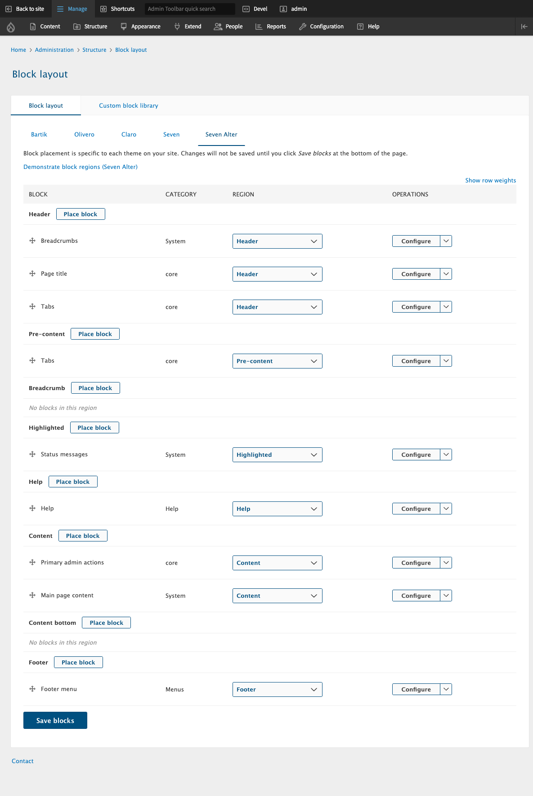

# Seven Alter - Theme

Seven Alter is an admin theme for Drupal.

Also checkout the [**Seven Alter Toolbar**](https://github.com/frankyonnetti/sevenalter_toolbar) module. This module is used to display the toolbar theme on user-facing pages.

## Add to a Drupal site

https://www.drupal.org/docs/develop/using-composer/managing-dependencies-for-a-custom-project

Add to composer.json (the first part is already there).

    "repositories": [
        {
            "type": "composer",
            "url": "https://packages.drupal.org/8"
        },
        {
            "type": "git",
            "url": "https://github.com/frankyonnetti/sevenalter.git"
        }
    ],

Require the modules.

    composer require frankyonnetti/sevenalter

## Screenshot(s)

